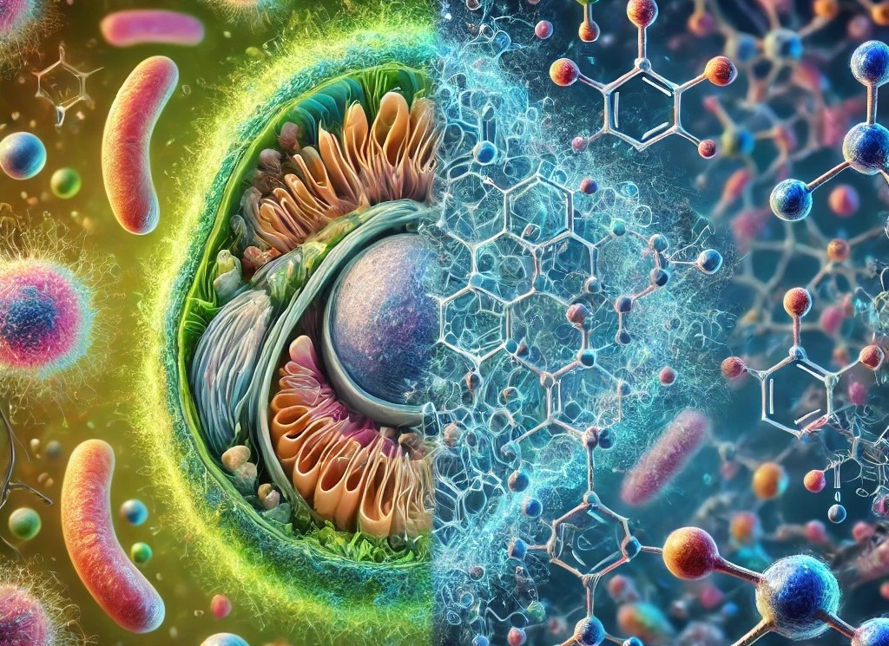
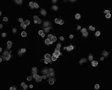
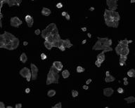
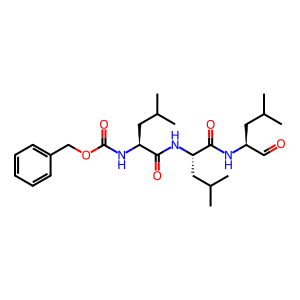
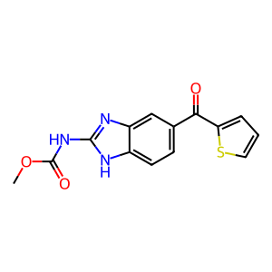
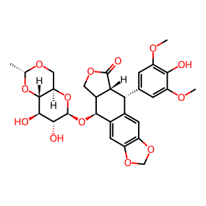

# Cell2Structure
  
<span style="font-size:8px">Image generated by ChatGPT - Image Generator</span>  

*This GitHub Repository is part of a Capstone project (SIADS-699) of the MADS (Master of Applied Data Science) program of the University of Michigan, School of Information.*

## Introduction
High content screening (HCS) consists in an approach of cell-based screening in drug discovery. It consists in treating cells in culture with a large set of chemical compounds, and to acquire microscopy images of these cells post treatment. The modifications of the cells induced by chemical treatment are a signature of the mode of action (MoA) of the chemical compound used. The objective is to discover new potent chemical compounds to obtain a given MoA, or new MoA, potentially leading to new treatments. 

Identification of the MoA can be done using picture recognition algorithms like convolutional neural networks (CNN). The chemical treatment induces modifications in the cells structures that can be recognized by CNN. Embeddings generated by a CNN trained to recognize MoA contain encoded information on the cell structure post treatment.  
The objective of our project is  to address the following high-level question:
* Can cell image embedding vectors be used as a translator between the image space and the space of chemical structures?

This project consists in two main parts:
* Training of a classifier using the Inception v3 architecture in Pytorch, to classify high content cell screening images for the mode of action (MoA) of chemical compounds used to treat the cells
* Exploring of the embeddings resulting from processing cell images with the classifier mentioned above, and the chemical compound structures, to detect potential for mapping from images to chemical structures.

## Python Environment Setup
Besides the standard data science Python libraries such as `Pandas`, `Numpy` and `Scikit-Learn` this project in addition uses the following ones:  
* PyTroch
* torchvision
* RDKit (cheminformatics library)
* InMoose (current pycombat implementation used for batch correction of genomics data)  

The Python environment can be set up using pip or conda/mamba  
_pip_
```
pip install -r requirements.txt
```  
_conda/mamba_  
```
conda env create -f environment.yml
```

## Project Configuration
The project uses global configuration file  
[project_config.toml](project_config.toml)  
This file contains paths, file names and parameters for most of the scripts.  
In addition to the global configuration a project utilities Python module had been created  
[project_utils.py](src/project_utils.py)

## BBBC021 Dataset
We used the publicly available [BBBC021 dataset](https://bbbc.broadinstitute.org/BBBC021) from the Broad Institute's Broad Bioimage Benchmark Collection [^1]. This dataset is mainly used for developing and comparing image-base profiling experiments. The dataset consists of CSV files contining the image metadata as well as the file names and 55 ZIP files containing the actual images.  
In addition to the original metadata provided along with the images a second version got created containing manually labled MoAs based on DrugBank, ChEML and PubChem:  
[BBBC021_final_enhanced_dataset.csv](data\processed\BBBC021_final_enhanced_dataset.csv)  

|DAPI channel|Tubulin channel|Actin channel|
|------------|---------------|-------------|
||||

### Downloading the Images
The images are download usin the following Linux shell script:  
[get_bbbc021_images.sh](src/get_bbbc021_images.sh)  
Downloading and unzipping the image files can take up to 30 min or longer, therefore this script is meant to run as SLURM batch job. It uses the setup of UMICH GreatLakes cluster. Running it in another environment need changes to the paths specified in the script.  

### Downloading and Preprocessing the Metadata
The following Python script downloads the metadata CSV files:  
[get_dataset.py](src/get_dataset.py)  
After downloading the CSV files the preprocessing is done via the Python script:  
[preproc_dataset.py](src/preproc_dataset.py)  
This script takes all 3 CSV files and merges it into one dataset which is used throughout the project.

### Data Exploration
An EDA had been conducted after downloading and preprocessing the CSV files. The analysis can be found in the notebook:  
[BBBC021_data_exploration.ipynb](notebooks/BBBC021_data_exploration.ipynb)  

## Classifier Training
We first wanted to train the pre-trained model to enable the generation of more specific image embedding vectors. We took the performance of a classfier as a proxy for the quality of the embedding vectors.

### Classifier training attempt 1
We originally intended to perform the classifier training using the jupyter notebook:
[finetuning.ipynb](notebooks/finetuning.ipynb)  
In this notebook, we retrain onyl the last fully connected layer. For this attempt, we organized the training data into a subfolder structure corresponding to the class label of each image. Sorting the images into the right folder structure was done with the notebook:  
[image_sorting.ipynb](notebooks/image_sorting.ipynb)  
In addition to this notebook a command line Python script can also be used for this task:  
[sort_images.py](src/sort_images.py)

This apporach led to a slow cross entropy loss decrease, we therefore switched to another approach: we fine tuned the last convolutional layers of the CNN on our dataset in addition to training the last fully connected layer. 

### Classifier training attempt 2
We first identified which convolutional layers made most sense to fine tune using the notebook:  
[CNN_features_visualization.ipynb](notebooks/CNN_features_visualization.ipynb)  
We then unfroze the weights of these layers and retrained the model.  
Multiple models had been created using different parameters. The model training was executed on different HPC clusters. The following scripts represent the execution on the GreatLakes cluster using 1 GPU:  


We then switched from a jupyter notebook to a .py script to finetune the model using a GPU:  
[model_training.py](src/model_training.py)  
Two additional Python modules were used in model training script:  
* [capstone_dataset.py](src/capstone_dataset.py) - Python class implenting a PyTroch Dataset
* [capstone_transforms.py](src/capstone_transforms.py) - Python module implementing various transformations applied to the input images  


The model finetuing was executed on a HPC cluster. The following script was used on the UMICH GreatLakes cluster:  
[run_training.sh](src/run_training.sh)  

## Embedding Generation
From our trained models we chose the following ones:  
* Inception V3 base model
* Inception V3 training the last 2 mixture layers
* Inception V3 traingin the last 2 mixture layers and applying data augmentation to the input images (random flip, horizontal and vertical)  

The generation of the image embedding vectors was exectued on the HPC cluster applying a GPU:  
[generate_embeddings.py](src/generate_embeddings.py)  
It uses the same `capstone_dataset` and `capstone_transfomrs` Python modules as the model training.  

The following script was used on the UMICH GreatLakes cluster to schedule the job:  
[run_embd_generation.sh](src/run_embd_generation.sh)  

After generating the image embeddings we applied a batch correction to correct differences based on experimental conditions:  
[batchcorr_img_vectors.py](src/batchcorr_img_vectors.py)  

The batch corrected image embeddings were merged back into the BBBC021 dataset using the following script:  
[merge_embeddings.py](src/merge_embeddings.py)  

## Embedding Clustering and Analysis
Embedding clustering was performed in the following notebook:  
[Embedding_clustering.ipynb](notebooks/Embedding_clustering.ipynb)  

Analysing the embedding vectors was performed in the follwoing notebook:  
[Analyze_Embed_Vectors.ipynb](notebooks/Analyze_Embed_Vectors.ipynb)

## Chemical Structure Exploration and Analysis

|MG-132|Nocodazole|Etoposide|
|------------|---------|----------|
||||

The chemical structurs were analysed based on 2 different ... :
* Molecular fingerprints: Morgan fingerprints, radius = 2, length = 2048
* Full set of RDKit molecular descriptors  

Script for the creation of the molecular fingerprints:  
[calc_chemical_fps.py](src/calc_chemical_fps.py)  
Script for the creattion of the RDKit descriptors:  
[calc_chemical_props.py](src/calc_chemical_props.py)  
Exploration and analzysis happened in the following notebboks:  
[Compound_similarity_analysis.ipynb](notebooks/Compound_similarity_analysis.ipynb) - Molecular fingerprints  
[Compound_similarity_analysis_descr.ipynb](notebooks/Compound_similarity_analysis_descr.ipynb) - RDKit descriptors  

## Availability of Intermediate and Final Model and Embedding Files
Our repositroy doesn't contain intermediate and final datasets containing the image embeddings as well as the exported PyTorch model files. This is due to the size of these files and the storage limitations in this type of GitHub repository.  

[^1]: We used image set [BBBC021v1](https://bbbc.broadinstitute.org/bbbc/BBBC021) [[Caie et al., Molecular Cancer Therapeutics, 2010](http://dx.doi.org/10.1158/1535-7163.MCT-09-1148)], available from the Broad Bioimage Benchmark Collection [[Ljosa et al., Nature Methods, 2012](http://dx.doi.org/10.1038/nmeth.2083)].